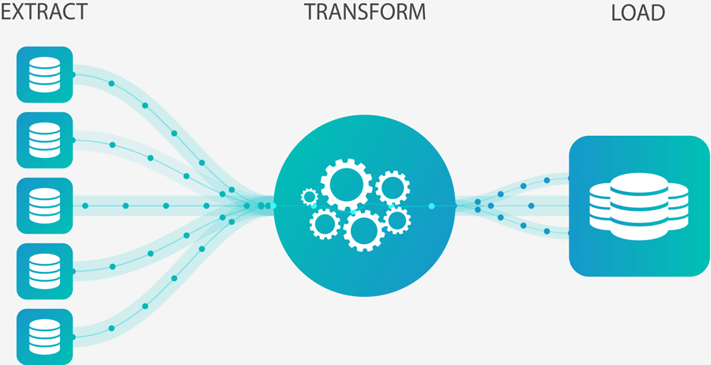
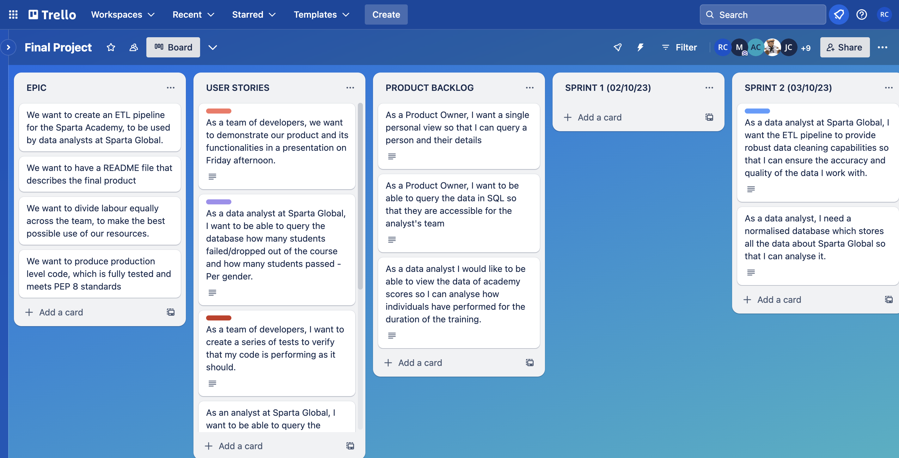
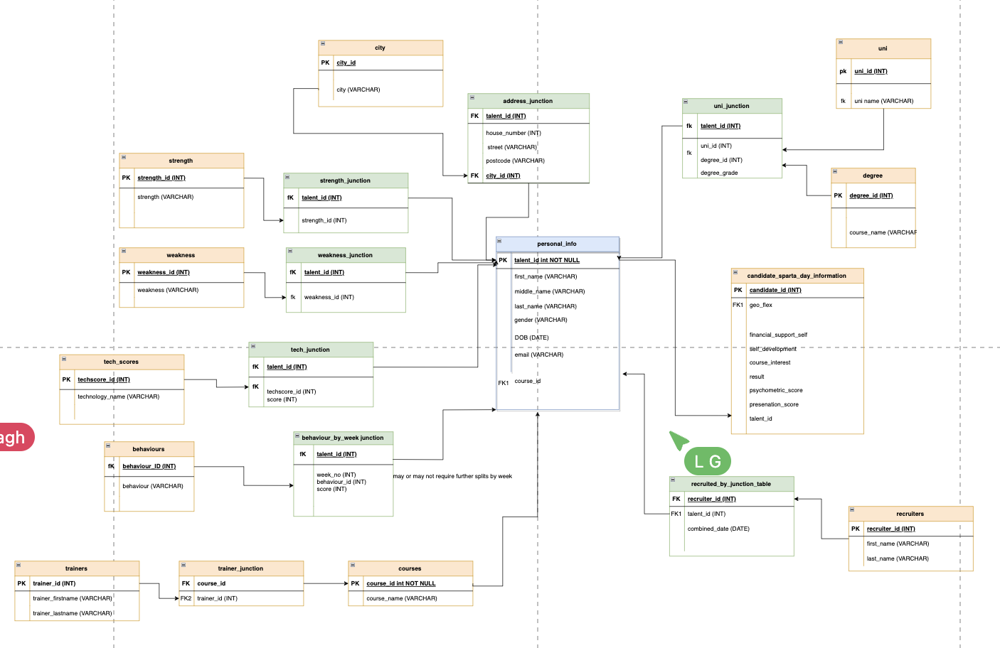

# Sparta Data 249 ~⚙~ Final Project 

For our final project, we've created an ETL pipeline to ingest, transform, and input fictional Sparta Global data into a database which provides a single person view.

                                                    ~⚙~⚙~

                                                    ~⚙~⚙~

# Contents

1. [Methodology](#methodology)
2. [How to Install](#howto)
3. [Credits](#credits)

#  Methodology

We followed Agile methodology and a Scrum framework to carry out this project, using  a Trello board to prioritise work and map out user stories.   
    

## <a href= "https://trello.com/b/r6ubxE2s/final-project">Link to our Trello Workspace</a>

                                                    ⚙⚙⚙

The data are loaded into a SQL database which is normalised to third normal form. Creating an Entity Relation Diagram was an important preliminary step in the pipeline process, which enabled us to plan our data manipulation and write our scripts. 

## <a href= "https://drive.google.com/file/d/1ooZ4fmxefSlmGnYa4AS6cw7-YV5a2VI2/view?usp=sharing">Link to our Full ERD Diagram</a>

                                                    ~⚙~⚙~

## How to Run and Install

In order to run the pipeline, it is first necessary to set up the database in a SQL server such as Azure Data Studio or Microsoft SQL Server. The script to create the database is provided in the config file. This should be run, and the database structure set up before the pipeline script can be deployed. 

# Credits

### SCRUM Master: 
Martin Wormwell @MW200410

### Product Owner: 
Taslima Hossain @taslimahossain

### Git Authority

Yuvraj Mahida @Yuvraj-26

### Data Engineering Team

- Ruth Chanarin  @ruthChanarin

- Tommy Ainsworth @tommyainsworth

- Killian Hughes @Kill-Hxps

- Sophie Wilkie @wilkiesophie

- Isak Grimsson @IsakGrimsson

- Jack Cavanagh @JCav23

- Lauren Gorst @LaurenG123

- Karis Reimers @Karisjr

- Andrew Carver @andyc2901

Also, big credit & thanks to Tommy & Paula, our wonderful and ever so patient trainers, for giving us the skills to put this project together, and empowering us in our data engineering journeys. 

